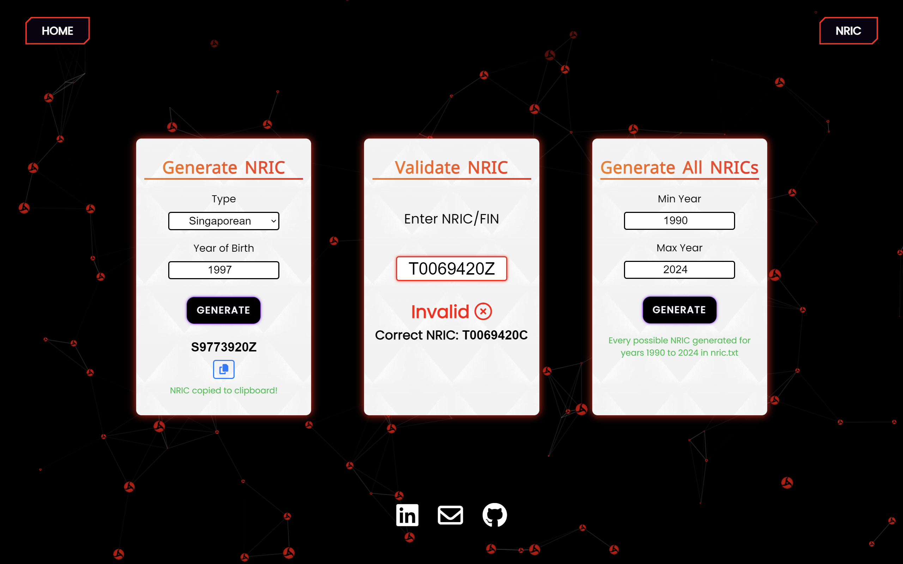

## bloodlusted.com

Code for my personal website. Keeping it extremely simple for now (WIP) 😊

Live site: https://bloodlusted.com  

  

## NRIC Generator and Validator

### What is this?
The most accurate and extensive NRIC & FIN generator and validator out there: https://bloodlusted.com/nric

#### Key Features

* Generate any Singaporean NRIC or Foreigner FIN, including the new "M" series.
* Specify the year of birth or year of issuance to generate the NRIC/FIN.
* Generate valid NRICs for Singaporeans born before 1968.
* Validate any NRIC/FIN. If invalid, the correct NRIC/FIN will be shown.
* **Generate every possible valid NRIC for any given year range** (output to text file).

*Note: Selecting a year below 1968 will result in every possible NRIC before 1968 being generated, because NRICs for Singaporeans born before 1968 do not relate to year of birth.*   

### Why did you make this?

* Other NRIC generators out there fail to generate valid NRICs before 1968, either by not allowing their creation or generating invalid ones.

* This is the only NRIC generator that allows you to generate every possible NRIC that has ever existed, or will ever exist. 
Well, until 2099 at least.

#### Story time
I received a document from the government that was supposed to be password-protected by my NRIC, but the password didn't work. Tired of waiting for a reply *(they never did btw lol)*, I theorized that the staff might have accidentally used another person's NRIC as the password, so I decided to write a Python script to generate a wordlist containing every possible NRIC within my year range and leave the rest to John the Ripper.

I managed to crack the password, but during my research on the NRIC algorithm, I found that all existing NRIC generator sites were lacking. They either did not support the new "M" series FINs, could not generate pre-1968 NRICs, or generated invalid pre-1998 NRICs. Additionally, none of them offered the ability to generate NRICs for a specified year range. So, I decided to translate my Python code to Javascript and create a web app out of it. You didn't have to read this far, but thank you.

 

